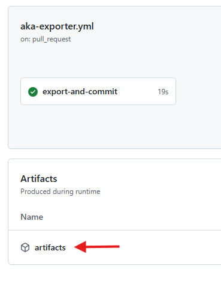

# AKA tools

## AKA exporter

To get the recent URLs registered to AKA, open the latest artifact [for this action](https://github.com/unoplatform/aka.tools/actions/workflows/aka-exporter.yml).

> ## Last run
> The last run version is publish [>>ON THIS BRANCH>>](https://github.com/unoplatform/aka.tools/tree/generated-report)

Additional notes:

- It runs automatically every 6 hours
- The [action](https://github.com/unoplatform/aka.tools/actions/workflows/aka-exporter.yml) in place can be triggered manually as needed, you just need to re-run the latest build

